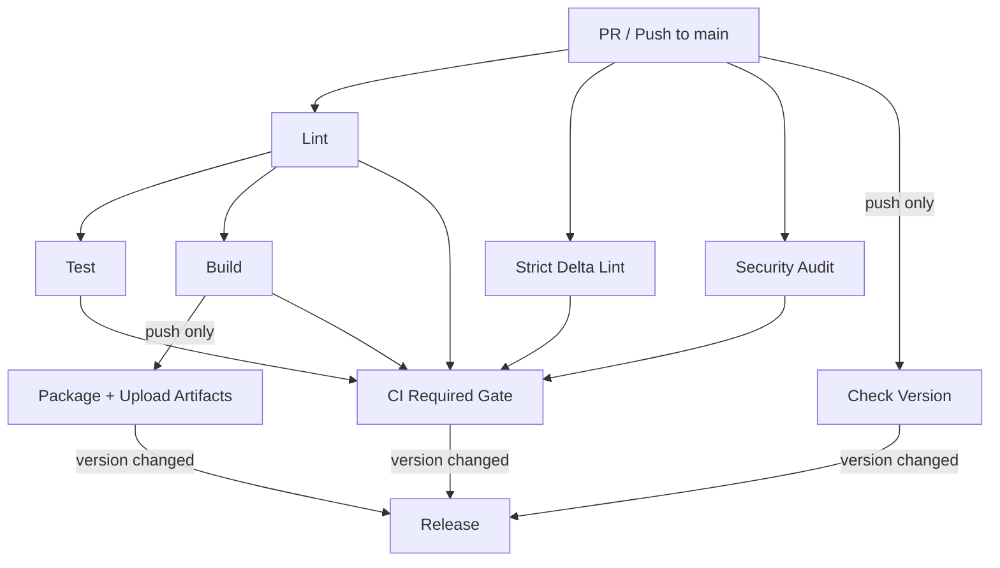

# CI/CD

All CI/CD runs through a single workflow: [`.github/workflows/ci.yml`](workflows/ci.yml).

## Triggers

| Event | What runs |
|---|---|
| **Pull request** to `main` | Lint, Strict Delta Lint, Test, Build (compile check), Security Audit, Gate |
| **Push** to `main` | Everything above + Package artifacts + Release (if version bumped) |

## Jobs

| Job | Description | Depends on |
|---|---|---|
| **Lint** | `cargo fmt --check` + `cargo clippy -D warnings` | — |
| **Strict Delta Lint** | Clippy `-D warnings` scoped to changed lines only | — |
| **Test** | `cargo test --locked` | Lint |
| **Build** | Release build for Linux x86_64, macOS x86_64, macOS aarch64. On push: also packages and uploads artifacts. | Lint |
| **Security Audit** | `cargo audit` + `cargo deny check licenses sources` | — |
| **CI Required Gate** | Composite check — fails if any upstream job failed or was cancelled. Set this as the only required status check in branch protection. | All of the above |
| **Check Version** | Compares `Cargo.toml` version against previous commit (push to main only) | — |
| **Release** | Downloads build artifacts, creates a GitHub release with `gh release create` (only if version changed and gate passed) | Gate, Check Version, Build |

## How to trigger a release

1. Bump the `version` in `Cargo.toml`
2. Merge to `main`
3. CI builds, packages, and creates a GitHub release tagged `vX.Y.Z` with binaries attached

## Pipeline diagram



## Branch protection

In repo settings, require the **CI Required Gate** status check on `main`. This single job covers all upstream checks — no need to list each individually.

## Local hooks

The pre-push git hook (`.githooks/pre-push`) runs the same quality gate locally before each push. Enable with:

```sh
git config core.hooksPath .githooks
```

Opt-in for stricter checks:

```sh
SEVAL_STRICT_LINT=1 git push        # full -D warnings clippy
SEVAL_STRICT_DELTA_LINT=1 git push   # strict lint on changed lines only
```
